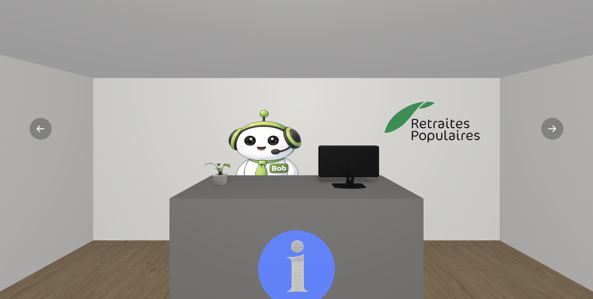

# BOB - Best Office Buddy 💭
POC d'un bureau virtuel permettant à ses utiisateur.ice.s d'optimiser le appréhension des outils de communication et de gestion de fichiers utilisés au sein de leur entreprise.

## Sommaire 🛣️
- [Description](#description-)
- [Fonctionnalités générales](#fonctionnalités-générales-)
- [Stack technique](#stack-technique-️)
- [Installation](#installation-)
- [Crédits](#crédits-)

## Description 📗
Best Office Buddy est un environnement 3D développé en Vue.js et A-Frame. Il simule l'intérieur d'un bureau et permet aux utilisateur.ice.s d'interagir avec l'environnement et les éléments qui s'y trouve. Cet environnement vise à faire un lien entre des objets physiques et les outils numériques équivalent et ainsi, diminuer l'imcompréhension que ces logiciels peuvent générer.

En production, cette interface sera(it) allimentée par l'utilisation d'un LLM ou de Machine Learning. Cela offrirait à BOB un accès à l'ensemble du contexte de l'entreprise.



## Fonctionnalités générales 🏢

### Caméra 🎥
Exploration de l'environnement
- Rotation de la caméra grâce à deux boutons
- Positionnement statique de la caméra

### Interaction 👋🏻
Au clique, certains objets permettent de simplifier une action que l'utilisateur.ice souhaite effectuer :
- **BOB** : Résumé quotidien des nouvelles et dernières communications reçues
- **Étagère** : Système d'aide à la gestion et au stockage des fichiers
- **Statue de la Justice** : Reccueil des règlementations et directives de l'enteprise
- **Imprimante** : Système d'aide à l'identification et l'utilisation des templates de l'entreprise
- **Téléphone** : Système d'identification et de simplification des outils de communication de l'entreprise

## Stack technique ⚙️
- **Front-end** : Vue.js
- **3D** : A-Frame

## Installation 🛫

### Prérequis du projet
- **Node.js 18.x ou supérieur** : Utilisation de modules ES

### Repository GIT
```bash
git clone https://github.com/floriansalvi/HEIG-VD_InnovationCrunchTime_ACB7.git
cd HEIG-VD_InnovationCrunchTime_ACB7
```
### Installation des dépendances
```bash
npm ci
```

### Mode développement
```bash
npm run dev
```

### Build
```bash
npm run build
```

## Crédits 👥
Ce travail a été réalisé durant l'Innovation Crunch Time à la HEIG-VD.

Durant cette semaine, notre équipe formée de 5 étudiant.e.s de dernière année de Bachelor et issu.e.s de différentes filières, a été plongée dans un défi proposée par les Retraites Populaires qui souhaitait optimiser leur communication interne et la gestion de leurs fichiers.

### Équipe
- **Anthony Christen** : BSc en Informatique et systèmes de communication
- **Florian Salvi** : BSc en Ingénierie des Médias
- **Tamara Katrina Langel** : BSc en Economie d'entreprise
- **Vladimir Starikov** : BSc en Economie d'entreprise
- **Zaïd Schouwey** : BSc en Informatique et systèmes de communication